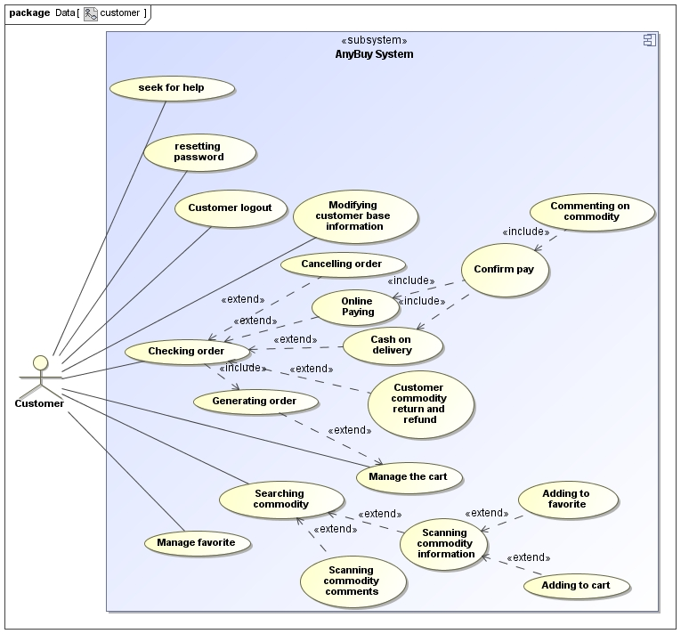
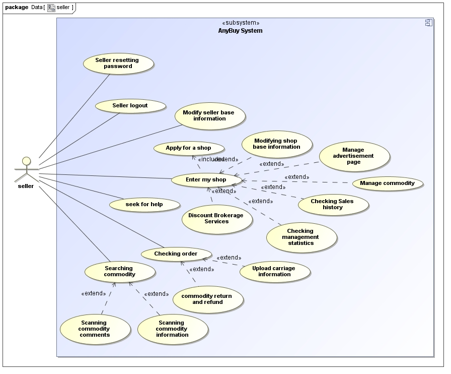
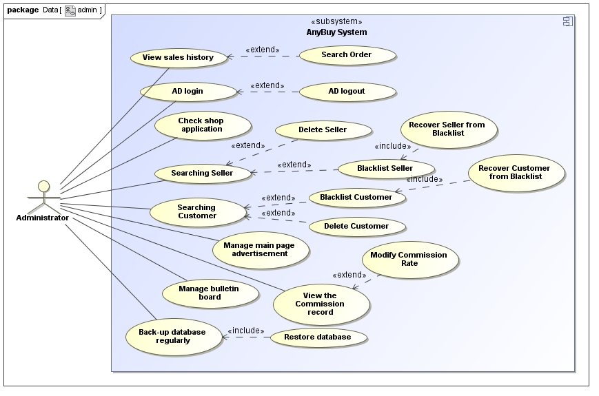
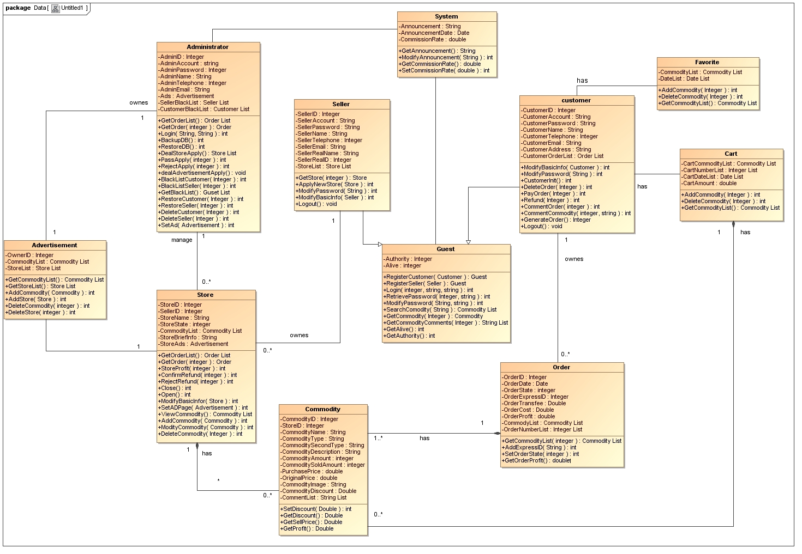
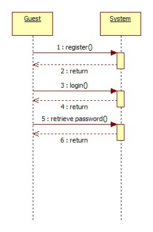
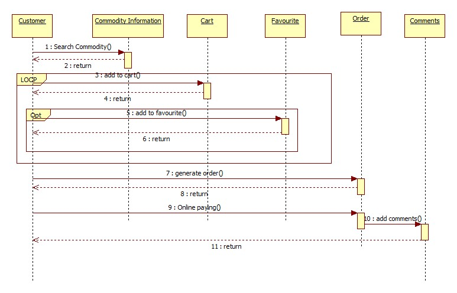
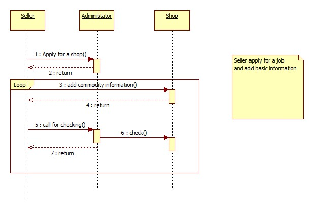
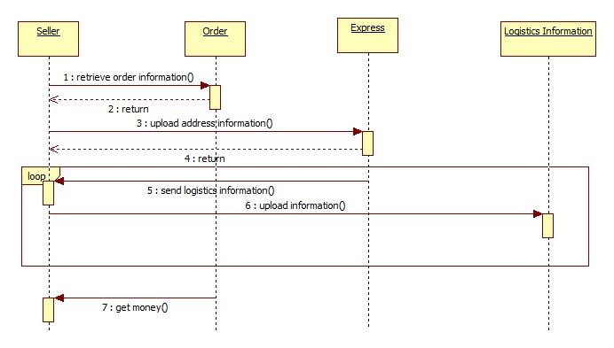

#项目管理 - Software Architecture Design Document

###Version

2014/10/9 Version 2.1  
Readme.md in github(with markdown language).  
Author: Sean Guo

2014/10/6 Version 2.0  
整理组内报告，翻译文档，书写Software Architecture Design Document，并审核文档。  
作者：郭世恒  

2014/10/5 Version 1.3     
与BA再次协商用例图，分析客户核心需求。与DBA讨论类图的成员变量的问题，分析DBA提供的Data View，并统一类变量。与Programmer讨论类图的架构，设计统一接口的API，并添加详细的API接口描述。  
作者：郭枭鹏，李晓宇  

2014/10/4 Version 1.2      
分析用例图，添加序列图设计，设计系统操作流程，描述卖家、买家的主要操作流程。    
作者：刘焕    

2014/10/3 Version 1.1    
添加部署图，分析逻辑视图的架构，设计类图。    
作者：郭枭鹏，李晓宇     

2014/10/2 Version 1.0    
构建文档基本框架。分析Requirement Analysis Requirements List Document，Software Requirement Specification，设计用例图及用例图描述。    
作者：郭枭鹏，李晓宇    

----

###1. Introduction
1. Project Topic    

	AnyBuy, the online Shopping management system is developed to help the seller and customer make a deal through the Internet. It will be convenient for both sellers and customers. On one hand, the seller can put their commodities on the website for the customer to scan and buy, On the other hand, the website allow the customers to make a comment on the commodities they consumed. The system provides an interactive way to sellers and customers. There are also some other effective functions for the sellers and customers in the system.     

2. Definition, Acronyms and Abbreviations    
	
	See the Glossary of project. 
	
3. References
	
	* QA Document
	* Project Description
	* Requirement Analysis Requirements List Document
	* Software Requirement Specification 
	* DBA Design

###2. Architectural Representation    

This document presents the architecture as a series of diagrams and views: conceptual diagram, context diagram, use case view, logical view, deployment view and data view. These diagrams and views were drawn under **MagicDraw UML 16.6 SP1**.     
###3. Architectural Goals and Constraints

There are some key requirements and system constraints we have to concern about when designing the architecture, they are:    

1. Large commodities’ data and complex relationship mean E-R module database will be a good choice. 
2. Large number of commodities’ information, Customers and Shop Owners’ basic information need to be stored safety in database. 
3. The Online Shopping Management System will be implemented as a browser-server system. 
4. The system server should ensure more than 500 visitors accessing stably at the same time and ensure more than 1000 people simultaneously access the database, the server's response time should not exceed 5 seconds. 
5. All customers can access server successfully whether through Internet or private networks.
6. System must ensure the security of data access, users need a user name and password authentication, and access to data to be authorized certification. 

###4. Use-Case View 用例视图

1. **Guest 游客** 
	
	
	
		
	* Searching commodity 搜索商品  
			游客可以在未登录情况下进行商品的搜索与查看。
			
		* Scanning commodity information 浏览商品信息
					游客可以在搜索商品后，选择具体商品，进入商品详情页面，浏览商品信息。
		* Scanning commodity comments 浏览商品评论
					游客可以在搜索商品后，选择具体商品，进入商品详情页面，浏览商品评论。
	* Help center 帮助中心  
				游客可以进入网页内的帮助中心栏目寻求帮助。
				帮助中心需要有常用FAQ以及基本用户操作教程。
	* Login 登录  
	游客可以通过帐号和密码登录。
		* Register 申请帐号  
		游客可以申请买家帐号或卖家帐号。
			* Customer Retrieving password 买家取回密码  
				游客可以选择哪种类型帐号的取回密码。首先进行身份验证，输入正确的邮件地址。验证成功后，系统直接重置密码并发送新密码至用户的邮件。
			* Seller Retrieving password 卖家取回密码
			
			
2. **Customer 买家**
	
	

	
	* Searching commodity 搜索商品    
		买家可以在系统中进行商品的搜索与查看。  
		* Scanning commodity information 浏览商品信息  
				买家可以在搜索商品后，选择具体商品，进入商品详情页面，浏览商品信息。  
			* Adding to cart 添加商品至购物车  
						买家可以在商品详情页面内直接添加商品至购物车。直接购买可以通过此功能实现，直接跳转至生成订单页面即可。  
			* Adding to favorite 添加收藏商品  
						买家可以在商品详情页面内直接添加商品至收藏列表。  
		* Scanning commodity comments 浏览商品评论  
					可以在搜索商品后，选择具体商品，进入商品详情页面，浏览商品评论。  
	* Help center 帮助中心  
				买家可以进入网页内的帮助中心栏目寻求帮助。  
				帮助中心需要有常用FAQ以及基本买家操作教程（购物，付款，退款等）。  
	* Customer logout 买家登出  
				默认Customer角色是已经登录过的。这里买家可以选择进行登出操作。
	* Modifying customer base information 修改买家基本信息  
				买家可以修改自己的基本信息。例如地址、联系方式等，基本信息中没有关于账户安全、买家信用的系统信息。  
	* Customer resetting password 买家重置密码  
				买家可以进行重置密码的操作，跳转新页面，填写旧密码与新密码，然后进行修改。  
	* Manage the cart 管理购物车  
				买家可以随时进入购物车页面进行管理。可以删除商品、修改购买商品的数量、生成订单操作。  
		* Generating order 生成订单	  	
					买家可以确认购买当前购物车的商品，生成订单。买家随时可进入订单页面查看订单列表。  
	* Manage favorite 管理收藏商品（查看，删除）  
				买家可以随时进入收藏列表进行管理，可以删除商品，浏览商品信息页面。  
	* Customer Checking order 买家查看订单  
				买家可以随时查看订单列表。  
		* Cancelling order 取消订单  
					买家可以取消某一个未付款的订单。  
		* Online Paying 在线支付  
					买家可以通过在线支付的方式为订单付款。  
		* Cash on delivery 货到付款  
					买家可以通过货到付款的方式为订单付款。  
		* Confirm Pay 确认支付  
						买家在验收货物以后，确认支付，完成交易。  
			* Commenting on commodity 评论商品  
						对于已经付款但尚未确认收货的订单，买家可以确认收货，并进行评论商品的操作。  
		* Customer commodity return and refund 买家商品退货  
						对于已经付款但尚未确认收货的订单，买家可以申请商品退货。
							

3. **Seller 卖家**

	
	
	* Searching commodity 搜索商品  
				卖家可以在系统中搜索商品。
		* Scanning commodity information 浏览商品信息  
					卖家可以在搜索商品后，选择具体商品，进入商品详情页面，浏览商品信息。
		* Scanning commodity comments 浏览商品评论  
					卖家可以在搜索商品后，选择具体商品，进入商品详情页面，浏览商品评论。  
	* Help center 帮助中心  
				卖家可以进入网页内的帮助中心栏目寻求帮助。  
				帮助中心需要有常用FAQ以及基本卖家操作教程（申请店铺，添加商品，下架商品，处理订单，发货，处理退款等）。  
	* Seller logout 卖家登出  
				默认Seller角色是已经登录过的。卖家可以选择进行登出操作。  
	* Modify seller base information 修改卖家基本信息  
				卖家可以修改自己的基本信息。例如地址、联系方式等，基本信息中没有关于账户安全、卖家信用的系统信息。  
	* Seller resetting password 卖家重置密码  
				卖家可以进行重置密码的操作，跳转新页面，填写旧密码与新密码，然后进行修改。  
	* Enter my shop 进入我的店铺  
				卖家可以选择其中一个店铺进入，进行具体操作。如果没有店铺，可以申请店铺。  
		* Apply for a shop 申请店铺  
					卖家可以向管理员提出申请，通过填写一份申请表提交给系统，等待管理员进行审核。审核通过后在店铺列表中就出现了对应的店铺。审核不通过系统将提示对应信息。  
		* Modifying shop base information 修改店铺基本信息  
					卖家可以修改店铺的基本信息，例如店铺的介绍，店铺的分类等。
		* Manage commodity 管理商品  
					卖家可以在具体的店铺内管理商品。需要设计专门的商品管理页面，卖家可以添加商品、删除商品、修改商品。
			* Add commodity 添加商品  
							卖家可以添加商品，添加商品跳转到新页面，卖家需要填写商品的信息。
			* Modify commodity 修改商品  
							卖家可以修改商品信息，其操作类似于添加商品。
			* Delete commodity 删除商品  
							卖家可以删除店铺内的某类商品。删除商品需要先进入商品管理页面。
		* Manage advertisement page 管理广告页面  
					卖家可以修改店铺内的广告页面，广告分为Homepage Shop list / Homepage Product list。卖家可以添加或删除对应广告。
		* Discount Brokerage Services 折扣服务  
					卖家进行折扣服务操作，将商品打折销售。可以规定打折的系数/百分比/折数，打折的时间期限等。
		* Checking Sales history 查看销售记录  
					卖家可以查看店铺内的商品销售记录。即整个店铺的订单情况。
		* Checking management statistics 查看经营统计情况  
					卖家可以查看所有店铺下的商品销售记录并统计盈利情况。这里涉及到所有店铺的销售记录，开设店铺费用，广告费用等。  
	* Seller Checking order 卖家查看订单  
		* Upload carriage information 上传快递信息  
		* Seller commodity return and refund 商品退货  

4. **Administrator**

	
	
	* AD login 管理员登录  
		管理员登录入口与其他用户登录不同，管理员由特定的域名登录，需要管理员帐号/管理员ID和密码进行验证，登录后的页面与客户看到的页面不同。  
		由于登录的页面不同，这里也不需要设计管理员搜索商品的功能，管理员在客户系统用guest查看商品即可。
		* AD logout 管理员登出  
	* Check shop application 查看店铺申请  
				管理员可以查看店铺申请列表，审核店铺申请表，并选择是否通过审核。若通过审核，则为对应卖家设置新的店铺，若未通过审核，需要发送邮件通知卖家原因。  
	* Searching Seller 搜索卖家  
				与客户的搜索商品不同，管理员是搜索帐号。  
		* Blacklist Seller 添加卖家至黑名单  
				管理员可以将指定卖家添加到黑名单中.
			* Recover Seller from Blacklist 恢复黑名单卖家  
		* Delete Seller 删除卖家  
	* Searching Customer 搜索买家  
		* Blacklist Customer 添加买家至黑名单  
			* Recover Customer from Blacklist 恢复黑名单买家  
		* Delete Customer 删除买家  
	* Manage main page advertisement 管理主页广告  
	* View sales history 查看销售历史(查看整个系统的订单, 分日/周/月/年供查看)  
		* Search Order 搜索订单  
	* View Commission record 查看佣金记录（日/周/月/年）  
		* Modify Commission Rates 修改佣金率  
	* Manage bulletin board 管理公告板  
	* Back-up database regularly 定期备份数据库  
	* Restore database 恢复数据库  
		
###5. Class Diagram View

		1. Customer
			* CustomerID 买家编号
			* CustomerAccount 帐号(String)
			* CustomerPassword 密码
			* CustomerName 用户昵称(可修改)
			* authority 用户权限(int,0-禁止登录,1-可登录) (继承自Guest)
			* alive 用户登录标识(int,0-Guset,1-Customer,2-Seller) (继承自Guest)
			* CustomerTelephone 电话
			* CustomerEmail 邮件地址
			* CustomerAddress 默认邮寄地址
			* CustomerOrderList 买家订单列表
			* int ModifyBasicInfo(Customer ); 修改基本信息，用户昵称，电话，邮件，邮寄地址。返回成功与否。
			* int ModifyPassword(Sting Old,String New); 修改密码
					参数为旧密码与新密码，先匹配旧密码，旧密码匹配成功则修改新密码至数据库。修改成功返回1.失败返回0.
			* int CustomerInit(); 买家对象初始化。根据Account的值，从数据库中检索出对应信息，实现对象的初始化。  
			* int DeleteOrder(integer); 删除订单,根据OrderID删除对应订单。返回成功与否。
			* int PayOrder(integer); 确认订单付款.
			* int Refund(integer); 申请订单退款
			* int CommentOrder(integer); 评论订单商品，传入OrderID, 依次对每个商品进行评论。
			* int CommentCommodity(integer CommodityID,String comment); 评论特定商品。返回成功与否。
			* integer GenerateOrder(); 生成订单(根据购物车),添加新订单至CustomerOrderList, 并返回新OrderID.
			* int Logout(); 用户登出.返回成功与否。
			* 类图备注：Cart & Favorite均为Customer的内部类。
		2. Seller
			* SellerID 卖家编号
			* SellerAccount 帐号
			* SellerPassword 密码
			* authority 用户权限(int,0-禁止登录,1-可登录) (继承自Guest)
			* alive 用户登录标识(int,0-Guset,1-Customer,2-Seller) (继承自Guest)
			* SellerName 用户昵称
			* SellerRealName 卖家实名
			* SellerRealID 身份证号
			* SellerTelephone 电话
			* SellerEmail 邮件地址
			* ShopList 店铺列表
			* Shop GetShop(integer); 进入具体店铺
			* int ApplyNewShop(Shop); 申请新店铺,用户填写申请表，写入基本店铺信息，生成new Shop, 店铺状态为待审核。返回申请提交成功与否。
			* int ModifyPassword(Sting Old,String New); 修改密码
					参数为旧密码与新密码，先匹配旧密码，旧密码匹配成功则修改新密码至数据库。修改成功返回1.失败返回0.
			* int ModifyBasicInfo(Seller); 修改基本信息，用户昵称，电话，邮件等。返回成功与否。
			* void Logout(); 用户登出
		3. Administrator
			* AdministratorID 管理员ID编号
			* AdministratorAccount 管理员帐号
			* AdministratorPassword 管理员密码
			* AdministratorName 管理员昵称
			* AdministratorTelephone 管理员电话
			* AdministratorEmail 管理员邮件
			* Advertisement 广告
			* SellerBlackList 卖家黑名单
			* CustomerBlackList 买家黑名单
			* OrderList GetOrderList(); 获得所有订单以查看销售历史。并计算出每一笔交易的佣金。
			* Order GetOrder(integer OrderID); 获得特定订单
			* int Login(Account, Password); 管理员登录
			* int BackupDB(); 备份数据库
			* int RestoreDB(); 恢复数据库
			* ShopList DealShopApply(); 处理店铺申请,从数据库中选择所有店铺状态为’待审核’的店铺。
			* int PassApply(ShopID); 审核通过
			* int RejectApply(ShopID); 审核不通过 
			* int BlacklistCustomer(integer CustomerID); 拉黑用户, 参数为用户ID
			* int BlacklistSeller(integer SellerID);
			* GuestList GetBlacklist(); 查看黑名单信息,返回账户列表。
			* int RestoreCustomer(integer CustomerID); 恢复帐号
			* int RestoreSeller(integer SellerID); 恢复帐号
			* int DeleteCustomer(integer CustomerID); 删除帐号
			* int DeleteSeller(integer SellerID); 删除帐号
			* int SetAd(Advertisement Ad); 配置主页广告
		4. Shop
			* ShopID 店铺ID
			* SellerID 卖家ID
			* ShopName 店铺名称
			* ShopState 店铺状态(0-待审核, 1-营业, 2-歇业)
			* CommodityList 商品列表
			* ShopBriefInfo 店铺简介
			* ShopAds 广告
			* OrderList GetOrderList(); 获得对应店铺订单列表。展示订单内的商品进价、卖价，利润，以查看店铺经营情况。
			* Order GetOrder(integer OrderID); 获得订单
			* int ShopProfit(integet); 计算店铺的利润，传入参数代表(0-日,1-周,2-月,3-年)
			* int ConfirmRefund(integer); 确认订单退款
			* int RejectRefund(integer); 拒绝订单退款
				砍掉回复评论的功能。
			* int Close(); 关闭具体店铺
				传入店铺编号，向系统提出关闭店铺，更改店铺状态为’歇业’。
			* int Open(); 重新开店,更改店铺状态为’开业’;
			* int ModifyBasicInfo(Shop); 修改基本信息。
			* int SetAdPage(Advertisement Ad); 设置店铺广告
			* CommodityList ViewCommodity(); 查看店铺商品
			* int AddCommodity(Commodity new); 添加商品
			* int ModityCommodity(Commodity old); 修改商品
			* int DeleteCommodity(CommodityID); 删除商品
		5. Commodity
			* CommodityID 商品ID
			* ShopID 店铺ID
			* CommodityName 商品名称
			* CommodityType 商品类型
			* CommoditySecondType 商品二次类型
			* CommodityDescription 商品描述
			* CommodityAmount 商品数量(剩余数量)
			* CommoditySoldAmount 商品销售数量
			* PurchasePrice 进价
			* OriginalPrice 销售原价
			* CommodityImage 商品图片(String URL)
			* CommodityDiscount 折扣系数
			* CommentsList 商品评论列表
			* int SetDiscount(double); 设置折扣信息
			* double GetDiscount();获得商品折扣信息
			* double GetSellPrice(); 根据原价与折扣系数计算出卖价。
			* double GetProfit(); 计算商品单个利润情况.
		6. Order
			* OrderID 订单编号
			* OrderDate 订单生成时间
			* OrderState 订单状态(0-待付款,1-已付款待发货,2-待签收,3-待评价,4-待退款,5-退款成功)
			* OrderExpressID 快递单编号
			* OrderTransfee 运费
			* OrderCost 订单金额
			* OrderProfit 订单利润(买家不可看,根据商品的进价，卖价，数量计算得出。)
			* CommodityList 商品列表
			* OrderNumberList 商品数量列表
			* CommodityList GetCommodityList(integer OrderID); 根据订单ID，从数据库中获得订单商品列表
			* int AddExpressID(String); 添加快递编号信息
			* int SetOrderState(integer state);设置订单状态
			* double GetOrderProfit(); 计算订单利润
		7. Cart
			* CartCommodityList 购物车商品列表
					由很多个商品组成。
			* CartNumberList 商品数量列表
					商品数量与商品一一对应。
			* CartDataList 商品添加日期(与商品列表一一对应) 
			* CartAmount 金额
					由商品和商品数量计算得出总金额。
			* int AddCommodity(Integer); 添加商品
					传入商品编号以添加商品。
			* int DeleteCommodity(Integer); 删除商品
					传入商品编号以删除商品。每次删除一件商品，当商品剩余数量为0，则移除商品。
				修改商品数量通过添加/删除商品来实现。
			* CommodityList GetCommodityList(); 从数据库读取出对应买家的购物车商品列表。
		8. Favorite
			* FavoriteCommodityList 收藏商品列表
			* DataList 商品收藏日期(与商品列表一一对应)
			* void AddCommodity(Integer);
			* void DeleteCommodity(Integer);
			* void GetCommodityList(); 获得商品列表
		9. Guset
			* authority 用户权限(int,0-禁止登录,1-可登录)
			* alive 用户登录标识(int,0-Guset,1-Customer,2-Seller)
			* Guest RegisterCustomer(Customer); 注册买家帐号,传入买家信息, 注册特定帐号, 写入数据库，返回基类引用。
			* Guest RegisterSeller(Seller); 注册卖家帐号,传入卖家信息, 注册特定帐号, 写入数据库，返回基类引用。
			* int Login(integer,Account,Password); 登录帐号,根据标识选择买家/卖家登录，根据帐号密码进行登录，返回成功与否。
			* int RetrievePassword(integer,Account,Email); 
					找回密码,先验证身份(输入对应帐号与邮箱)。系统重置密码，新密码写入数据库，将新密码发送至邮箱。第一个参数表明身份为买家/卖家。
			* int ModifyPassword(Old,New); 修改密码,用于买家/卖家两个子类, 基类本身不用。用户填写旧密码与新密码，进行修改操作，写入数据库。
			* CommodityList SearchCommodity(String); 根据用户输入的字符串，搜索商品，返回商品列表。查看商品详情可以直接读取特定商品信息
			* Commodity GetCommodity(integer); 根据商品ID,返回特定商品。
			* StringList GetCommodityComments(integer); 获得商品评论,参数为CommodityID，内部调用Commodity类的API。返回商品评论列表。
			* int GetAlive(); 查看用户是否登录,返回登录标识
			* int GetAuthority(); 查看用户权限
		10. Advertisement
				广告类。系统主页有TOP Products & Top Shop, 店铺主页亦有Shop & Commodity, 因此这里设计一个类。
				管理员有一个公共的Advertisement类成员, 每个店铺Class Shop类中也有一个Advertisement.
			* OwnerID 拥有者ID(为店铺ID或系统)
			* CommodityList 商品列表
					存储广告所需的商品信息。类型为Commodity List.
			* ShopList 店铺列表
					存储广告所需的店铺信息。类型为Shop List.
			* CommodityList GetCommodityList();
					根据拥有者ID,从数据库中读取出Commodity List,存放至类内变量中。
			* ShopList GetShopList();
					根据拥有者ID,从数据库中读取出Commodity List,存放至类内变量中。
			* int AddCommodity(Commodity new); 添加新商品
			* int AddShop(Shop new); 添加新店铺
			* int DeleteCommodity(CommodityID); 删除商品
			* int DeleteShop(ShopID); 删除店铺
		11. System
				系统类。此类只有一个对象，代表系统主页上的公告板以及系统交易佣金率。
				管理员可以查看和修改，其他用户可以查看。
			* Announcement 公告(String)
			* Date 公告时间
			* CommissionRate 交易佣金率(每一笔交易都要收取)
			* String GetAnnouncement(); 查看公告板(公共API)
			* int ModifyAnnouncement(String); 修改公告(系统管理员权限)
			* double GetCommissionRate();
			* int SetCommissionRate(double newrate);
			
			
###6. Sequence View 序列图
编辑软件：StarUML 5.0
	
1. 游客登录流程  
	
2. 买家购买商品流程  
	
3. 卖家店铺管理流程  
	
4. 卖家处理订单流程    
	
	
###7. Deployment View 部署视图

	
1. 卖家PC与买家PC通过HTTP网络连接访问系统服务器。
2. 系统服务器通过Nginx进行网页代理。
3. 管理员通过HTTP网络连接访问系统服务器，其中与普通用户访问的域名不同，登录后的系统亦不同。
4. 系统与管理员都可以通过python-mysql可以直接对数据库进行操作。
5. 数据库使用MySQL搭建。
6. 系统与银行服务系统通过以太网进行连接，这里为简便省略银行服务系统。

###8. Data View 数据图   
wait...
###9. Quality  

The Online Shopping Management System using this software architecture shall satisfy good quality system requirements: 
	
1. The system’s server must be accessed under any popular browsers, like IE , 360, chrome .
2. The web page must be friendly and comfortable for customer to look.
3. The Online Shopping System should provide online help and FAQ for customers. 
4. System should ensure server run continuously over 7 x 24 hours. 
5. Ensure system being maintainable, and convenient to replace modules of system. 
6. Exception should be caught while error occurred, and message would be returned. 


